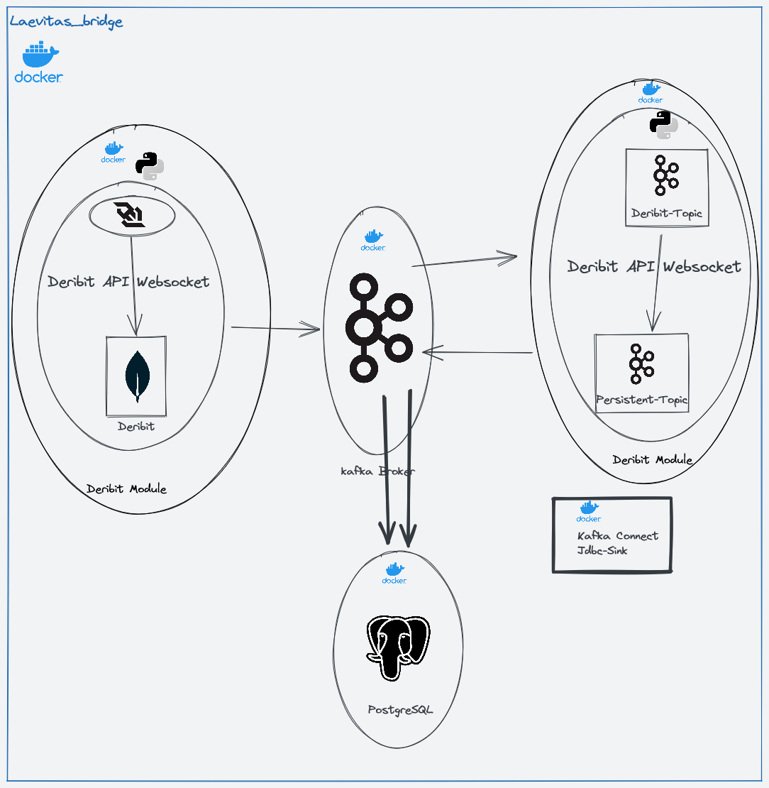
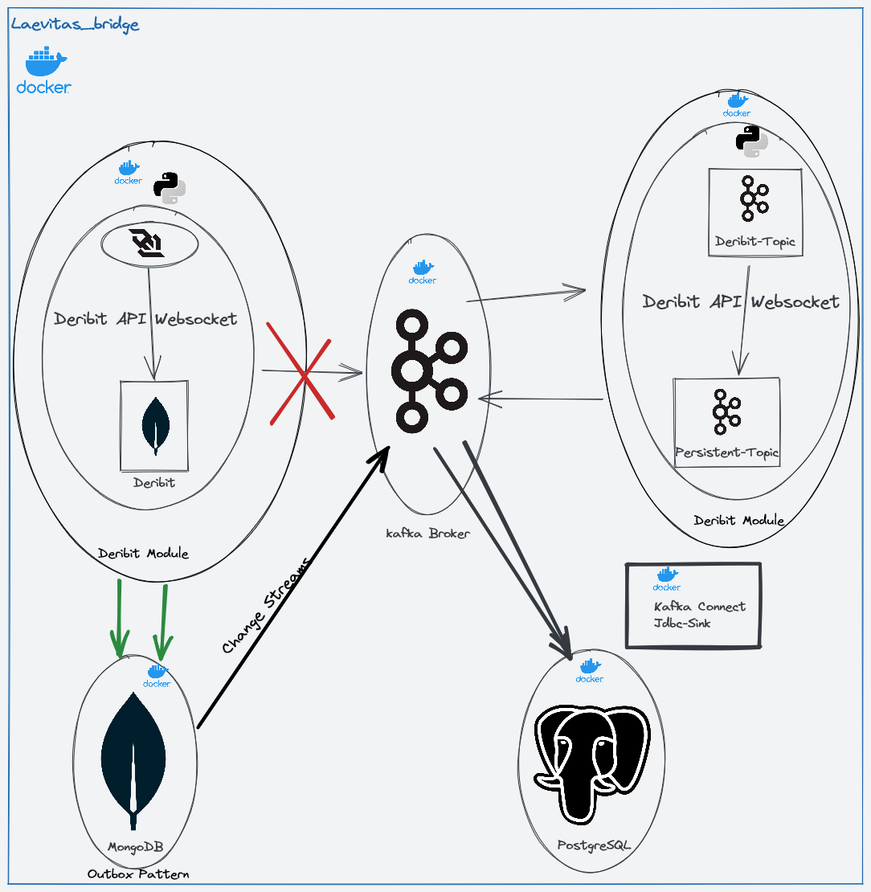

# Deribit Prices Extractor 

 
 

<!-- TOC --> 

* [Deribit Prices Extractor](#deribit-prices-extractor) 

  * [Tech stack:](#tech-stack-) 

  * [Testing stack](#testing-stack) 

  * [Installation](#installation) 

  * [Overview Architecture](#overview-architecture) 

  * [Development](#development) 

  * [Testing](#testing) 

  * [Roadmap](#roadmap) 

  * [Targeted Architecture:](#targeted-architecture-) 

<!-- TOC --> 

 
 

This Project aims to extract, parse and load data from Deribit API into PostgreSQL through Apache Kafka. 

 
 

It is designed in micro-services style to separate concerns between producer and consumer. 

 
 

Both of apps are deployed in docker. 

 
 

## Tech stack: 

* Derbit API 

* Docker 

* Docker-compose 

* Apache Kafka 

* Apache Kafka Connect 

 
 

## Installation 

 
 

* The pipeline was developed using docker. So it assumes you have docker installed on your machine 

 
 

1. Clone the repository 

```bash 

git clone https://github.com/ramibahrouni/Laevitas.git 

``` 

2. Run setup.sh and choose how the installation where goes. 

 
 

```bash 

cd Laevitas 

./setup.sh 

``` 

Notice: If you have windows and git bash not installed, please follow the next steps: 

 
 

1- Start Infra containers first (Postgres + Kafka). 

```bash 

docker-compose -f infra/docker-compose.yml up -d 

```` 

2- Start deribit reader 

 
 

```bash 

docker-compose -f deribit/docker-compose.yml up -d 

``` 

3- Start the consumer application 

 
 

```bash 

docker-compose -f consumer/docker-compose.yml up -d 

``` 

 
 

What will you see is something like in the snapshot below 

 
 
 
 

## Overview Architecture 

The pipeline was designed with two concepts in mind: 

 
 

I- Separation of concerns 

 
 

Producer and consumer should be separated from each other for scalability and performance matters. So you will find two containers on docker, where no module have a clue about the other, with Apache Kafka as stateful messaging between them. 

 
 

II- Database Outage 

 
 

Persistence into database that comes through outages could be challenging, and to overcome this, there are 3 ways: 

 
 

1- Write-behind cache 

 
 

Write-behind cache is a mechanism of caching that provides asynchronous writes to the database.In case of unavailability of the latter, the cache store will keep the data until postgres goes up. 

 
 

Pros: 

 
 

* Writing into cache is fast, performant and satisfies our need. 

 
 

Cons: 

 
 

* Considering the growth of data, caching will be a problem in terms of costs since it stores data in RAM. 

 
 

2- CSV Files 

 
 

This is could the simplest solution as it consists of writing data into csv files and then load into Postgresql using its built-in csv loader.  

 
 

Pros: 

 
 

* There are no additional costs of managing, deploying and maintenance of 3rd-Party component. 

* A very good and performant solution in batch and near real-time workloads. 

 
 

 Cons: 

* Not suitable for real-time.  

 
 

* Handling concurrency while writing files would be challenging since it could cause multiple issues and cause data loss. 

 
 

3- Pub/Sub system 

 
 

Using pub/sub system could be the most efficient solution since it offers queuing, caching and routing. 

It starts with producer (Write Deribit data into the pub/sub) and a consumer (read data from the pub/sub and routing it into destination that could pub/sub itself, database, ....) . 

Data with pub/sub could survive the outage of destination by being kept into the pub/sub system in Ram(like cache) or disk. 

Once the destination goes alive, pub/sub resumes loading data. 

 
 

Based on the mentioned ways and their specs, Our choice was a pub/sub system (Apache Kafka). 

 
 

 

 
 

## Development 

For the development, the code was written in python, the reason of choice is due to its fast learning curve that makes it a good candidate for PoC/Demo language. 

 
 

The entire project is dockerized and deployed in separate docker-compose files in order to keep the apps isolated. 

 
 
 
 

The project structure was decomposed into 3 parts: 

 
 

1- Deribit: 

 
 

This part contains the data fetcher that reads data from Deribit websocket and writing it into a topic in Apache Kafka. 

 
 

2- Consumer: 

 
 

This module aims to consume data from topic and to enrich it then load it into db topic 'persistent_topic' 

 
 

3- Infra 

 
 

This module contains docker-compose file that will deploy Apache kafka, Apache Kafka Connect and postgreSQL on docker. 

 
 

**Note**: DB persistence will be handled by a framework of Apache Kafka which is Apache  Kafka connect that provides scalability and parallelism for its connectors. 

 
 
 
 
 

## Testing 

* Since most of the code was written to handle non-functional logic, we write integration tests to make sure that each pipeline functions clearly.   

* We tried to use testcontainers as an integration test provider for kafka operations and postgres downtime mimic scenarios, however due to multiple issues related to libraries behaviour with python we skipped testcontainers for now and simply use the main infrastructure stack on docker. 

* Consumer is 90% covered in tests, it lacks a scenario for chaos engineering to create DB outage situation. 

* Producer requires creation of fake websocket server and mocking all the endpoints of Deribit to mimic requests and responses to and from client.(**TODO**) 

 
 

## Roadmap 

1- Write test for handling Deribit websocket functions. 

 
 

2- Implement a chaos engineering scenario for database downtime. 

 
 

3- Implement circuit breaker to add more resiliency to the pipelines since there is remote calls with remote service (Deribit API). 

 
 

2- Automate tests using CI runner 

 
 

3- Ensure data movement in case of Broker outage using Transactional outbox pattern and MongoDB. 

 
 

## Targeted Architecture: 

 
 


